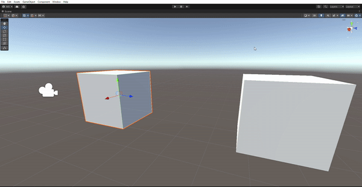
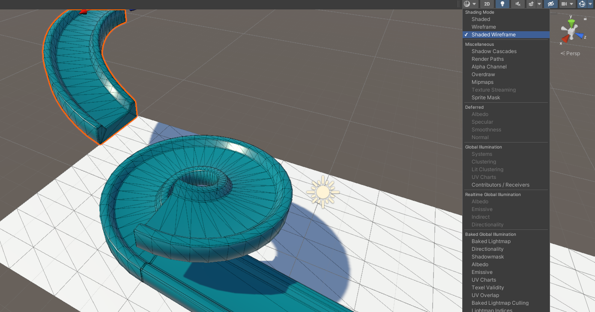

## Vertex snapping in Unity

To align two objects in Unity, **vertex snapping** can be used. A vertex is a point on a 2D or 3D model, such as the corner of a cube, or a point on a pyramid.

To use vertex snapping, select the object to be moved, then hold down the **V** key. As the mouse is moved, it will snap to different vertices. Once you have the correct vertex selected, you can click and drag the object to a vertex on another object.

If more complicated objects are being aligned, then it is easier to enable a wireframe view of the objects, using the Draw Mode.

Vertices can be seen where the lines meet each other, and can be more easily selected.

